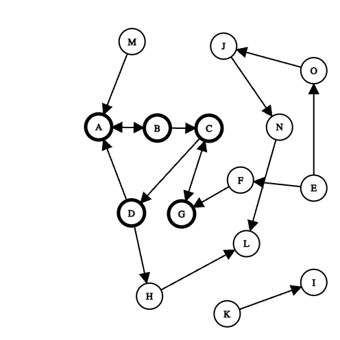

# HW1 - Report
### Chris Skeens
### Due Date: 09/15/24

# Q1
## Answer

- SCC: {A, B, C, D, G}
- IN: {E, F, M}
- OUT: {H, L}
- Tendrils: {O, J}
O: Reachable from IN
J: Reachable from IN E
- Tubes: {N}
Node N is considered a tube because it connects the IN node E to OUT node L.
- Disconnected: {K, I}
# Q2
## Answer
- (a)

- (b)
Command:
```
curl -k -v -H "User-Agent: CS432/532" https://www.cs.odu.edu/\~mweigle/courses/cs532/ua_echo.php
```

- (c)
Command:
```
curl -k -v -H "User-Agent: CS432/532" https://www.cs.odu.edu/\~mweigle/courses/cs532/ua_echo.php > output
```

- (d)


# Q3
## Answer
Method: 
This program takes a single argument as a seed page. Then it collects all href links from the given seed page. If the current link in the loop begins with 'http', the links content is checked for 'text/html', then checked for its content-length. If the content length is greater than 1000 bytes, the uri is added to a dictionary. I approached this program iteratively, testing each step as I went. Please find my exact pseudocode below. 
1. Use requests to return HTML
2. Parse HTML for "a href" tags
3. For each tag found, filter only href that begin with http
4. Use requests to return HTML form
5. If tag references an HTML file (text/html), check content length.
6. Content size exists and is > 1000, add to unique list and add to next seed item

# Seed websites:
- <https://www.sports.yahoo.com/>
- <https://www.linkedin.com/>
- <https://www.stanford.edu/>
- <https://www.harvard.edu/>
- <https://www.vpcc.edu/>
- <https://apnews.com/>
- <https://www.nbcnews.com/culture-matters>

# References
<<<<<<< HEAD
- <https://csacademy.com/app/graph_editor/>  
- <https://requests.readthedocs.io/en/latest/>  
- <https://www.crummy.com/software/BeautifulSoup/bs4/doc/>  
- <https://www.pythoncheatsheet.org/cheatsheet/basics>  
=======
<https://csacademy.com/app/graph_editor/>  
<https://requests.readthedocs.io/en/latest/>  
<https://www.crummy.com/software/BeautifulSoup/bs4/doc/>  
<https://www.pythoncheatsheet.org/cheatsheet/basics>  
>>>>>>> 113509c (Beep)
