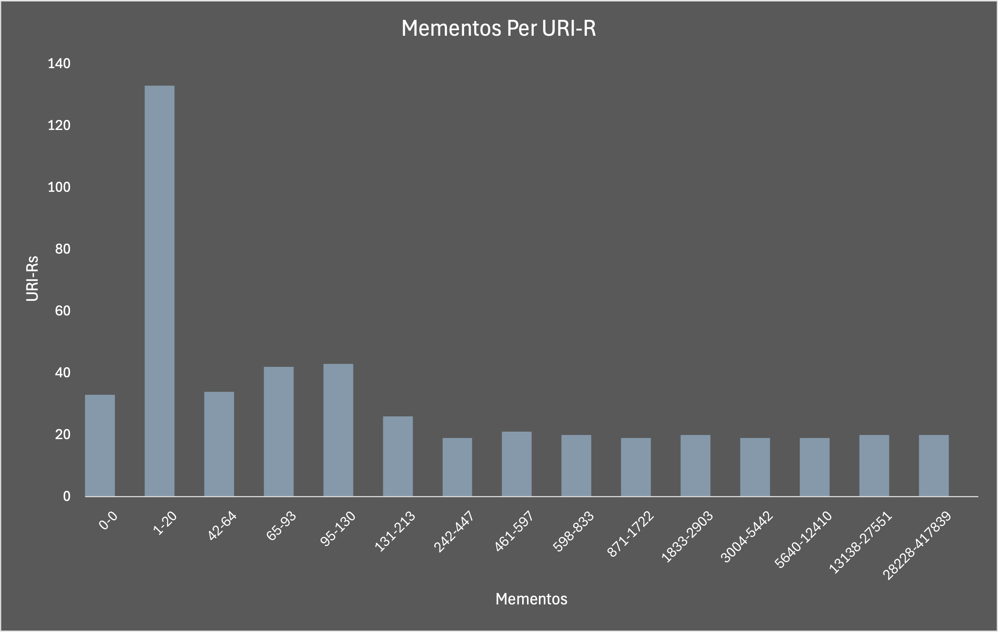

# HW3 - Report
### Chris Skeens
### Due Date: 10/20/24

## Q1: *Get TimeMaps for Each URI*
### Answer:
This process began by converting a [text file](./resources/key-uri.txt) containing hashed filenames into URI mappings. The hashed filenames were used as the filenames for each TimeMap that would be retrieved in the next step.
```
def convert_file(path):
    uri_dict = {}
    file = path

    with open(file, 'r') as file:
        lines = file.readlines()
    
    for line in lines:
        l = line.split(',')
        temp = l[0]
        hash_name = temp[:31]
        uri_dict[hash_name] = l[1]
    
    return uri_dict
```
For each key-value pair in the dictionary, the key was used for the JSON filename, and the value (URI) was used in the MemGator command. The calls to MemGator were scripted using Python's subprocess module. The [archives file](./resources/updated_archives.json) was from the EC MemGator assignment, with "wayback.archive-it.org" and "wayback.nli.org.il" removed due to [DDoS attacks](https://therecord.media/internet-archive-restores-some-services). A sleep timer of 20 seconds was used between each MemGator call to avoid being blocked. The entire process took just under four hours of runtime. 
```
def get_maps(processed_dict):
    output_dir = './time-maps'
    for key, value in processed_dict.items():
        file_name = key + ".json"
        output_filepath = os.path.join(output_dir, file_name)
        uri = value.strip()
        memgator_command = [
            'memgator',
            '-c',
            '"ODU CS432/532 cskee004@odu.edu"',
            '-a',
            './resources/updated_archives.json',
            '-F',
            '2',
            '-f',
            'JSON',
            uri
        ]
        with open(output_filepath, 'w') as output_file:
            subprocess.run(memgator_command, stdout=output_file)
        time.sleep(20)
```
## Q2: Analyze Mementos Per URI-R
Each TimeMap retrieved in the previous step was then parsed to determine how many mementos the given URI returned. A counter was used to track how many TimeMaps returned zero bytes. Out of 545 TimeMaps processed, only 33 returned no mementos. The number of mementos for each TimeMap was determined by adding each memento found to a temporary list and then using the length of that list to provide the total for the given TimeMap. The resulting dictionary from this step mapped the number of mementos to the number of TimeMaps that returned that amount of mementos. The dictionary was then sorted in ascending order by the key `num_mementos`. 

```
def parse_maps():
    zero_count = 0
    for name in os.listdir(r"./time-maps"):
        file_path = os.path.join(r"./time-maps", name)
        file_size = os.path.getsize(file_path)
        if file_size > 0:
            temp_list = []
            with open(file_path, encoding='utf-8') as f:
                data = json.load(f)
                for i in data['mementos']['list']:
                    temp_list.append(i)
            num_mementos = len(temp_list)
            results[num_mementos] += 1
        else:
            zero_count += 1
    results[0] = zero_count
    keys = list(results.keys())
    keys.sort()
    sorted_results = {i: results[i] for i in keys}
    return sorted_results
```
To finalize the results, pandas was used for quantile binning to create percentile groups and normalize the data since the range of mementos was large (0–417,839). The only downside was not being able to explicitly create a row just for the URI-Rs that returned 0 mementos. I accounted for this by manually inserting the row in the final table to reflect the zeros. The [bin list](./results/bin-mementos.txt) returned from this process matched the index of the [dictionary](./mementos-uri.txt), which contained the number of mementos to the number of URI-R mappings. 
```
def bin_results(d):
    keys_dict = list(d.keys()) 
    value_dict = list(d.values())
    ds = pd.Series(keys_dict)
    bd = pd.qcut(ds, q=15, labels=False)
    bin_list = bd.to_list() 
    merged_zip = zip(bin_list, zip(keys_dict, value_dict))
    merged_list = list(merged_zip)
    with open('./merged-list.txt', 'w') as f:
        for item in merged_list:
            f.write(str(item) + '\n')
    return merged_list
```
```
merged_list
(bin number, (number of mementos, number of URI-Rs))
...
(2, (61, 1))
(2, (63, 1))
(2, (64, 1))
(3, (65, 2))
(3, (67, 2))
(3, (68, 3))
...
```
| Mementos    | URI-Rs |
|-------------|--------|
| 0-0         | 33     |
| 1-20        | 133    |
| 21-41       | 56     |
| 42-64       | 34     |
| 65-93       | 42     |
| 95-130      | 43     |
| 131-213     | 26     |
| 242-447     | 19     |
| 461-597     | 21     |
| 598-833     | 20     |
| 871-1722    | 19     |
| 1833-2903   | 20     |
| 3004-5442   | 19     |
| 5640-12410  | 19     |
| 13138-27551 | 20     |
| 28228-417839| 21     |



## *Q: What URI-Rs had the most mementos? Did that surprise you?*
## Answer:
The URI-Rs with the most mementos came from leading news websites like Yahoo, The Associated Press, and NBC. I was most surprised by the 21 URI-Rs that resulted in a range of 28,228 to 417,839 mementos. If I were to do this again, I would aim to improve my dataset by including a broader variety of URI-Rs or by creating more focused datasets organized by website type. The issue with my current dataset is that it simply confirms the obvious: popular websites will always have more mementos than less popular ones. Additionally, popular news websites tend to contain numerous internal links, further increasing the number of mementos.

## References
- [subprocess](https://docs.python.org/3/library/subprocess.html)
- [JSON](https://docs.python.org/3/library/json.html)
- [Quantile Binning](https://pandas.pydata.org/docs/reference/api/pandas.qcut.html)
